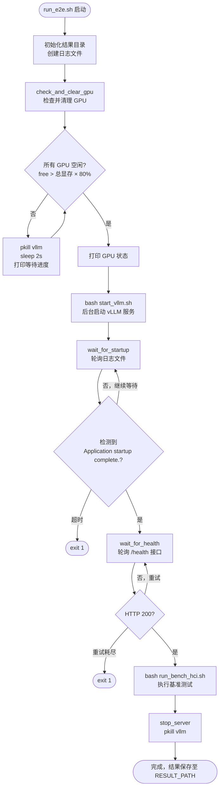

# 脚本使用说明

本项目包含三个脚本，用于在多 GPU 环境下自动化启动 vLLM 服务并执行性能基准测试。

| 脚本 | 作用 | 是否可单独使用 |
|------|------|---------------|
| `run_e2e.sh` | 端到端编排脚本，自动完成 GPU 清理、服务启动、基准测试、服务停止的完整流程 | ✓（推荐入口） |
| `start_vllm.sh` | 启动 vLLM 推理服务 | ✓ |
| `run_bench_hci.sh` | 对已运行的 vLLM 服务执行性能基准测试 | ✓（需先启动服务） |

---

## 1. run_e2e.sh — 端到端自动化脚本

### 与其他脚本的关系

`run_e2e.sh` 是顶层编排脚本，内部依次调用 `start_vllm.sh` 和 `run_bench_hci.sh`，并负责：
- 测试前清理 GPU 显存，确保环境干净
- 等待服务完全就绪后再触发测试
- 测试完成后自动停止服务
- 统一管理日志和结果目录

`start_vllm.sh` 和 `run_bench_hci.sh` **也可以脱离 `run_e2e.sh` 独立使用**（见第 2、3 章节）。

### 用法

```bash
bash run_e2e.sh [选项]
```

| 参数 | 默认值 | 说明 |
|----------|--------|------|
| `--model-path` | 脚本内默认模型路径 | 模型权重路径 |
| `--server-name` | 脚本内默认服务名 | vLLM served-model-name |
| `--port` | `5678` | 服务端口号 |
| `--tag` | `src` 或脚本内默认值 | 本次实验标签，用于区分结果目录 |
| `--output` | `./results/<SERVER_NAME>_<timestamp>_<TAG>` | 结果保存目录 |
| `--server-args` | 脚本内默认值 | 透传给 `start_vllm.sh`，并追加到 `vllm serve` 末尾 |
| `--bench-args` | 空 | 透传给 `run_bench_hci.sh`，并追加到 `vllm bench serve` 末尾 |

**示例：**
```bash
# 使用默认参数
bash run_e2e.sh

# 指定模型和标签
bash run_e2e.sh --model-path /nfs_data/weight/MyModel --server-name MyModel --port 5678 --tag fp8

# 透传服务端和基准测试附加参数
bash run_e2e.sh \
    --server-args "--hf-overrides '{\"index_topk_freq\": 4}' --max-num-batched-tokens 32768" \
    --bench-args "--request-rate 2"
```

### 结果输出

每次运行会在 `./results/` 下创建唯一目录：
```
./results/<SERVER_NAME>_<TAG>_<YYYYMMDD_HHMMSS>/
├── server_<TAG>.log     # vLLM 服务端日志
├── client_<TAG>.log     # 基准测试客户端日志
├── *.json               # 各测试用例的详细结果
└── *-summary.csv        # 汇总指标表格
```

### 使用的 GPU

脚本顶部通过 `CUDA_VISIBLE_DEVICES` 指定使用的物理 GPU（默认 `1,2`），修改该变量即可切换 GPU。

### 流程图



---

## 2. start_vllm.sh — vLLM 服务启动脚本

### 作用

封装 `vllm serve` 命令，提供参数化接口，可在无需 `run_e2e.sh` 的情况下独立启动推理服务。

### 用法

```bash
bash start_vllm.sh [选项]
```

| 参数 | 简写 | 默认值 | 说明 |
|------|------|--------|------|
| `--model-path` | `-m` | `/nfs_data/weight/hf_Sehyo-Qwen3.5-122B-A10B-NVFP4` | 模型权重路径 |
| `--server-name` | `-s` | `hf_Sehyo-Qwen3.5-122B-A10B-NVFP4` | served-model-name（客户端调用时使用） |
| `--port` | `-p` | `56781` | 监听端口 |
| `--server-args` |  | 空或脚本内默认值 | 追加到 `vllm serve` 末尾的参数 |

**示例：**
```bash
# 使用默认参数启动
bash start_vllm.sh

# 指定模型路径和端口
bash start_vllm.sh -m /nfs_data/weight/MyModel -s MyModel -p 8000

# 透传额外 serve 参数
bash start_vllm.sh -m /nfs_data/weight/MyModel -s MyModel -p 8000 \
    --server-args "--hf-overrides '{\"index_topk_freq\": 4}'"
```

### 关键配置

| 配置项 | 当前值 | 说明 |
|--------|--------|------|
| `-tp` | `2` | 张量并行度，需要 2 块 GPU |
| `--gpu_memory_utilization` | `0.9` | GPU 显存占用上限 90% |
| `--host` | `0.0.0.0` | 监听所有网络接口 |
| `--seed` | `42` | 随机种子，保证可复现性 |

> **注意：** 脚本内注释掉的选项（MTP 推测解码、KV Cache FP8、KV Offloading 等）可按需取消注释启用。

---

## 3. run_bench_hci.sh — 基准测试脚本

### 作用

对已运行的 vLLM 服务发送并发请求，测量吞吐量、TTFT、TPOT、ITL 等指标，并将结果保存为 JSON 和 CSV 文件。**使用前需确保 vLLM 服务已启动。**

### 用法

```bash
bash run_bench_hci.sh [选项]
```

| 参数 | 简写 | 默认值 | 说明 |
|------|------|--------|------|
| `--model-path` | `-m` | `/nfs_data/weight/hf_Sehyo-Qwen3.5-122B-A10B-NVFP4` | Tokenizer 路径（本地推断用） |
| `--server-name` | `-s` | `hf_Sehyo-Qwen3.5-122B-A10B-NVFP4` | 与 `start_vllm.sh` 的 `--served-model-name` 保持一致 |
| `--port` | `-p` | `56781` | vLLM 服务端口 |
| `--output` | `-o` | `./results/<name>_<tag>_<时间戳>` | 结果保存目录 |
| `--tag` | `-t` | `src` | 实验标签 |
| `--bench-args` |  | 空 | 追加到 `vllm bench serve` 末尾的参数 |

**示例：**
```bash
# 对本机 8000 端口的服务执行测试
bash run_bench_hci.sh -s MyModel -p 8000 -o ./results/my_test

# 完整参数
bash run_bench_hci.sh \
    -m /nfs_data/weight/MyModel \
    -s MyModel \
    -p 8000 \
    -o ./results/exp1 \
    -t fp8 \
    --bench-args "--request-rate 2"
```

### 测试用例配置

测试用例在脚本顶部的 `params` 数组中定义，每行格式为：

```
"request_rate  max_concurrency  num_prompts  input_len  output_len"
```

修改 `params` 数组来增删测试场景（已注释掉的行可按需取消注释）。

### 输出指标

每个测试用例生成一个 JSON 文件，并追加一行数据到 `*-summary.csv`。CSV 列说明：

| 列名 | 含义 |
|------|------|
| `request_rate` | 请求发送速率（req/s） |
| `max_concurrency` | 最大并发请求数 |
| `num_prompts` | 总请求数 |
| `input_start` / `output_start` | 实际输入/输出 token 长度 |
| `duration` | 总测试时长（s） |
| `request_throughput` | 请求吞吐（req/s） |
| `failed_requests` | 请求失败数量 |
| `output_token_throughput` | 输出 token 吞吐（tok/s） |
| `total_token_throughput` | 总 token 吞吐（tok/s） |
| `mean/p90/p95/p99_ttft` | 首 token 延迟（ms） |
| `mean/p90/p95/p99_tpot` | 每输出 token 延迟（ms） |
| `mean/p90/p95/p99_itl` | 逐 token 延迟（ms） |
